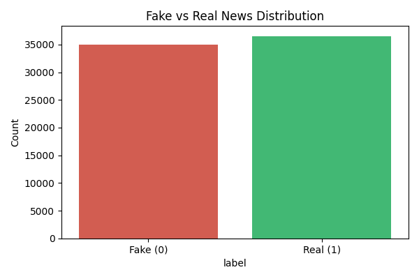
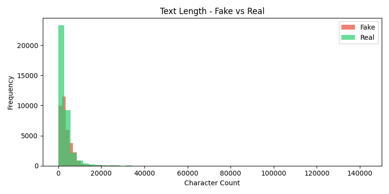
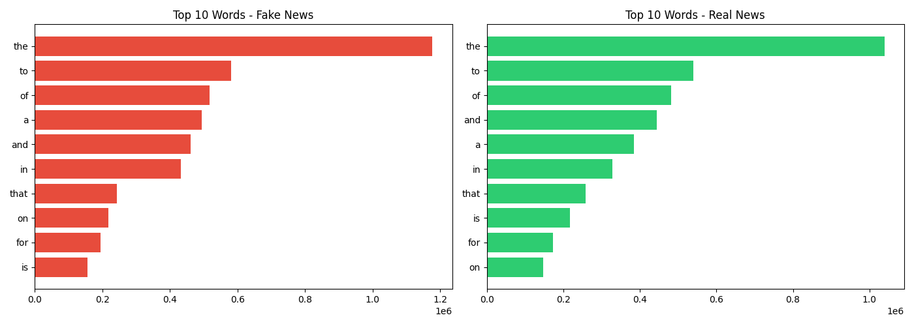

# 🔍 Fake News Detector using BERT


## 📌 Project Overview
A Fake News Detection system built using **BERT (Bidirectional Encoder Representations from Transformers)** fine-tuned on the WELFake dataset of 72,134 news articles. Achieved **98.12% accuracy** with a live Streamlit web app for real-time detection.

## 🎯 Key Results
| Metric | Score |
|--------|-------|
| Accuracy | 98.12% |
| F1-Score | 0.98 |
| Precision | 0.98 |
| Recall | 0.98 |

## 🛠️ Tech Stack
- **Model**: BERT (bert-base-uncased) via HuggingFace Transformers
- **Framework**: PyTorch
- **UI**: Streamlit
- **Data Processing**: Pandas, NumPy
- **Visualization**: Matplotlib, Seaborn
- **Dataset**: WELFake (72,134 articles)

## 📊 EDA Visualizations
### Class Distribution


### Text Length Analysis


### Top Words


## 🚀 How to Run
```bash
# Install dependencies
pip install transformers torch streamlit pandas scikit-learn

# Run the app
python -m streamlit run app.py
```

## 📁 Project Structure
fake-news-detector-bert/
├── app.py                      # Streamlit web app
├── fake_news_detector.ipynb    # EDA + Data cleaning
├── class_distribution.png      # EDA graph
├── text_length.png             # EDA graph
├── top_words.png               # EDA graph
└── README.md

## 👩‍💻 About
Built as part of AI/ML Python Internship Project.
Demonstrates end-to-end ML pipeline: Data → EDA → BERT Fine-tuning → Deployment
